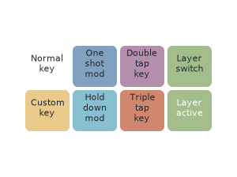
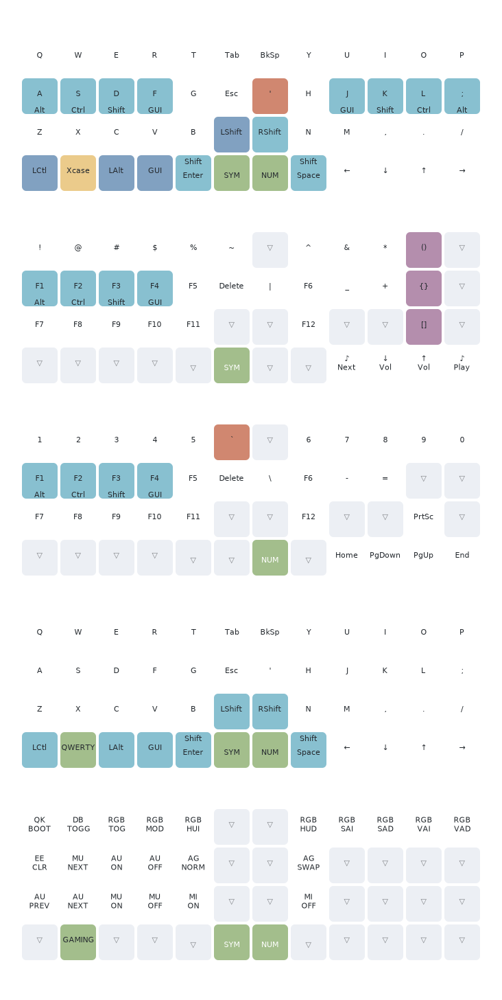

Plank Keymap
============

This is the custom keymap I use on my Plank rev7. It is inspired by
the great blogposts by [the darnest thing](http://thedarnedestthing.com/planck%20redux).

Visualisation
-------------

* Normal key: normal single tap keys, with default behavior for Shift;
* One shot mod: tap enables the modifier for the next key tap (allowing you
  to press `Shift` and `w` separately for an uppercase W), hold behaves
  like normal modifiers (holding `Shift` while tapping `w` creates an
  uppercase W);
* Hold down mod: tapping actives the key (e.g. arrow keys), holding actives
  the modifier (e.g. Ctrl);
* Double tap key: used for braces, where tapping the key twice produces
  `()`, with the cursor placed in the middle (saving a left-arrow keystroke);
* Triple tap key: used for quotes, behaves similar to double tap keys
  (tapping `'` three times creates `''` with the cursor in the middle);
* Layer switch: when hold, the layer is switched (e.g. holding `LOWER`
  temporary actives the Lower layer);
* Layer active: indicates the layer switch key is hold;
* Custom key: Enables the custom [X-Case mode](https://github.com/andrewjrae/kyria-keymap/tree/e3773e145252eb7f96557c50c9f2550cbcd62f60?tab=readme-ov-file#x-case).

